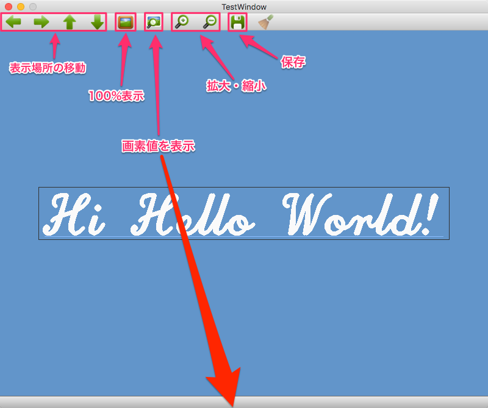
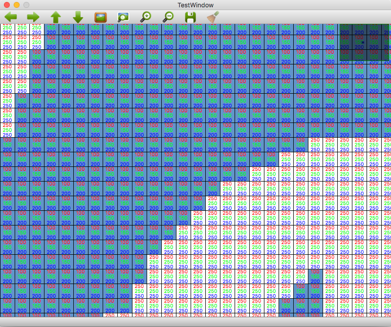

[TOP](https://github.com/maemori/OpenCV3_Sample/)
----

# [C++] OpenCV3 描画サンプル: フォントとテキスト 

## 0.内容

* cv::putText - テキストの配置
* cv::rectangle - 長方形の配置
* cv::line - 直線の配置

## 1.[サンプルコード](./main.cpp)

## 2.ビルド

``` bash
cmake .
make
```

## 3.実行

``` bash
./put_text_sample
```



