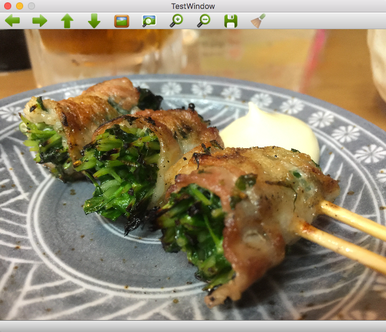

[TOP](https://github.com/maemori/OpenCV3_Sample/)
----

# [Go] OpenCV3 描画サンプル: 画像の読み込みとリサイズ

## 0.内容

* cvLoadImage - 画像の読み込み
* cvResize - リサイズ

## 1.[サンプルコード](./main.go)

## 2.ビルド

``` bash
go build main.go
```

## 3.実行

``` bash
./main
```


