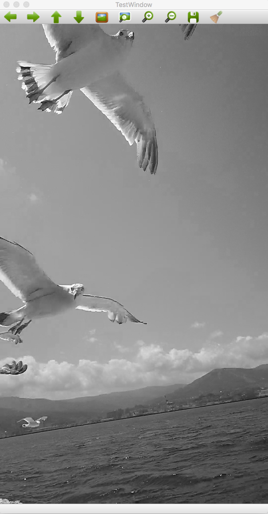

[TOP](https://github.com/maemori/OpenCV3_Sample/)
----

# [Go] OpenCV3 描画サンプル: 動画を読み込み、リサイズ＆モノクロ変換して再生

## 0.内容

* cvCreateFileCapture - 動画の読み込み
* cvQueryFrame - 再生フレームの取得
* cvResize - リサイズ
* cvCvtColounsafe(・・・, C.CV_BGR2GRAY)r - グレースケール変換

## 1.[サンプルコード](./main.go)

## 2.ビルド

``` bash
go build main.go
```

## 3.実行

``` bash
./main
```


